# 🛒 Clicon — Full Stack E-Commerce (MERN)

A modern and fully functional e-commerce web application featuring storefront shopping, product browsing, cart & checkout, orders, wishlist, compare, user dashboard, blog system, reviews, and an advanced **Admin Panel** with Role & Permission Management.

---

## 🚀 Tech Stack

| Layer      | Technologies Used |
|-----------|------------------|
| **Frontend** | React 18, Vite, Redux Toolkit, React Router, Tailwind CSS, MUI, React Query, Recharts, i18next |
| **Backend**  | Node.js, Express, MongoDB (Mongoose), JWT (Http-Only Cookies), Nodemailer |
| **Dev Tools** | Git, VS Code, NPM, MongoDB Compass / Atlas |

---

## 📂 Project Structure
clicon/
├─ client/ # Frontend (React + Vite)
│ ├─ src/
│ ├─ public/
│ └─ .env.example
│
└─ server/ # Backend (Node + Express + MongoDB)
├─ routes/
├─ models/
├─ utils/
└─ .env.example

---

## ⚙️ How to Run Locally

### 1️⃣ Start Backend API
```bash
cd server
cp .env.example .env
npm install
npm run dev
Backend will run on → http://localhost:4000
2️⃣ Start Frontend App 
cd client
cp .env.example .env
npm install
npm run dev
Frontend will run on → http://localhost:5173
🔐 Environment Variables
client/.env
VITE_API_URL=/api
VITE_BACKEND_ORIGIN=http://localhost:4000
server/.env
PORT=4000
MONGO_URI=mongodb://localhost:27017/clicon
JWT_SECRET=your-strong-secret
CLIENT_ORIGIN=http://localhost:5173
FRONTEND_ORIGIN=http://localhost:5173
DEMO_MODE=true
🔥 Features

✅ Product Browsing & Filters

✅ Wishlist & Compare

✅ Cart & Checkout

✅ Order Tracking

✅ Reviews & Ratings

✅ Blog / Posts System

✅ User Dashboard

✅ Admin Panel (Products, Orders, Posts, Support, Staff, Permissions)

✅ Multi-Language Ready (i18next)

✅ Secure Cookie-based Auth (No token exposure)
---

---

## 🖼️ Screenshots

| Page | Preview |
|------|---------|
| 🠠Homepage | 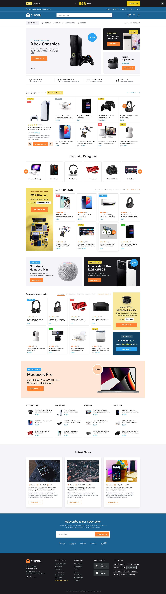 |
| 🛍️ Shop Page | 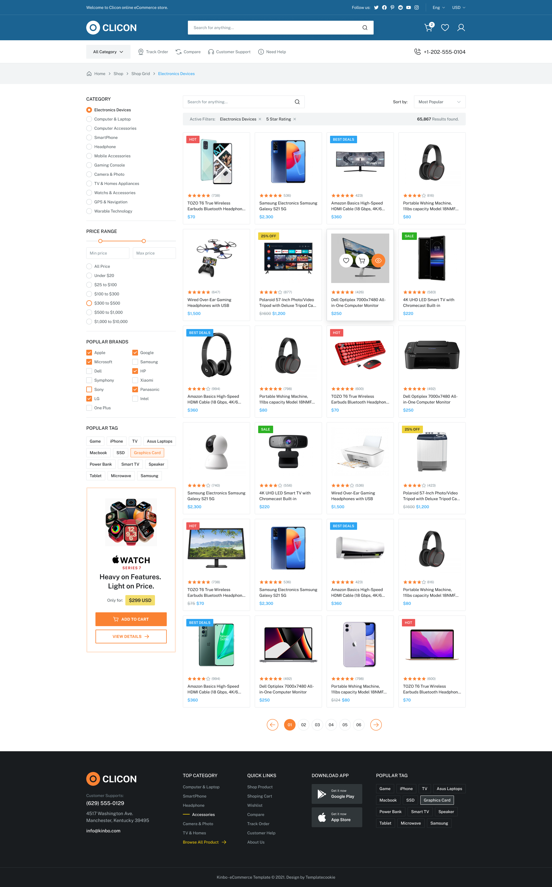 |
| 📄 Product Detail | 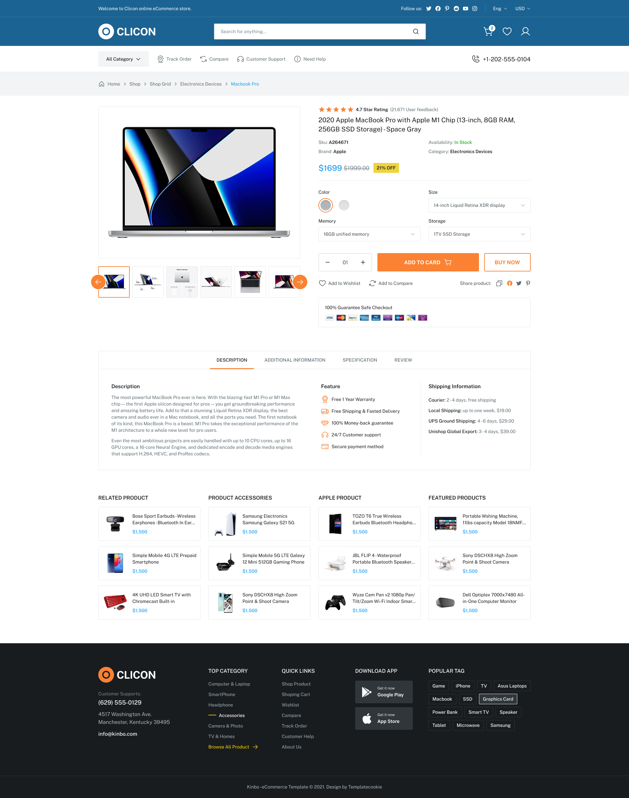 |
| 🚚 Track Order | 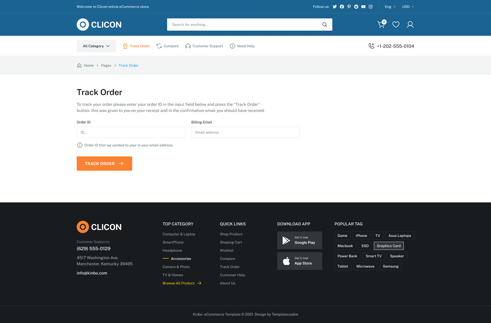 |
| 💖 Wishlist | 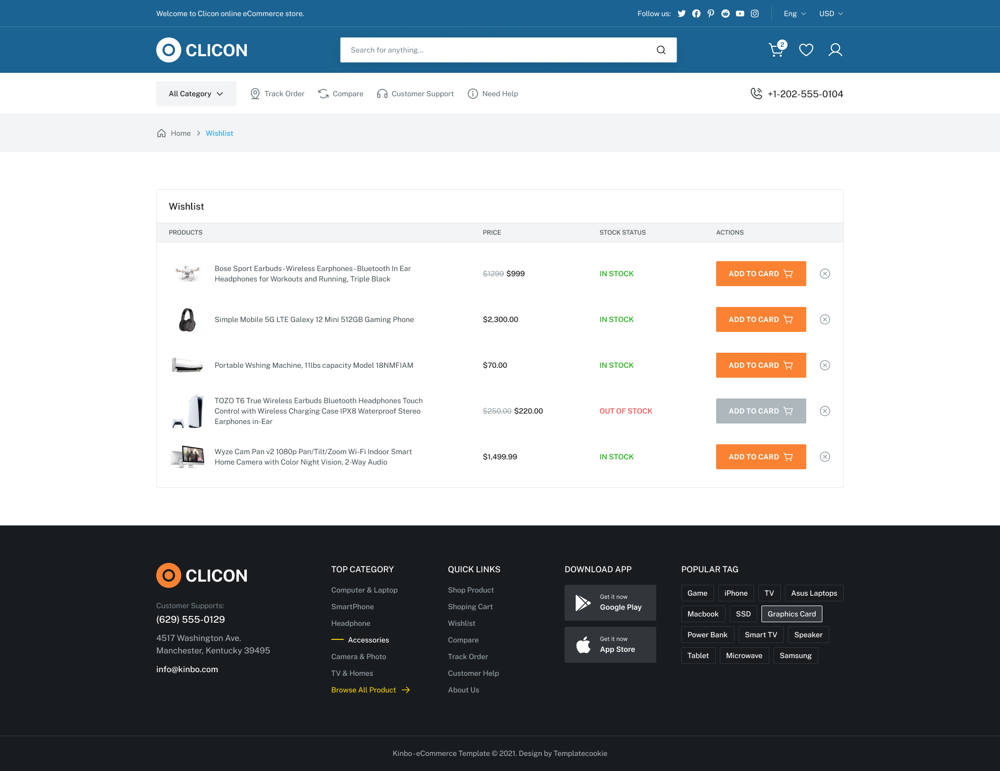 |
| 💳 Checkout | 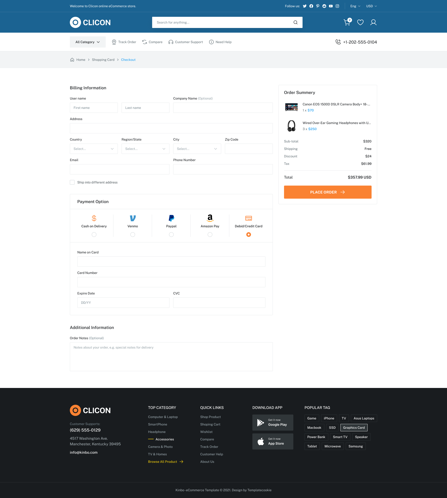 |
| ❓ FAQs | 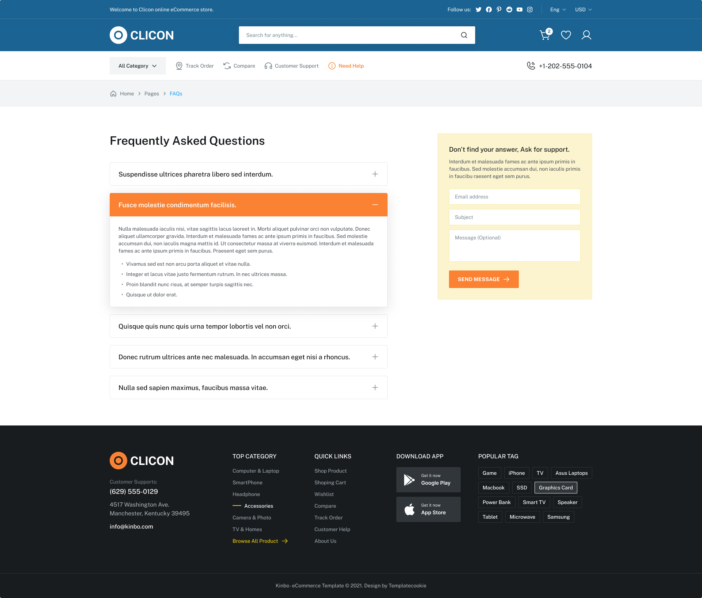 |
| ℹ️ About Us | 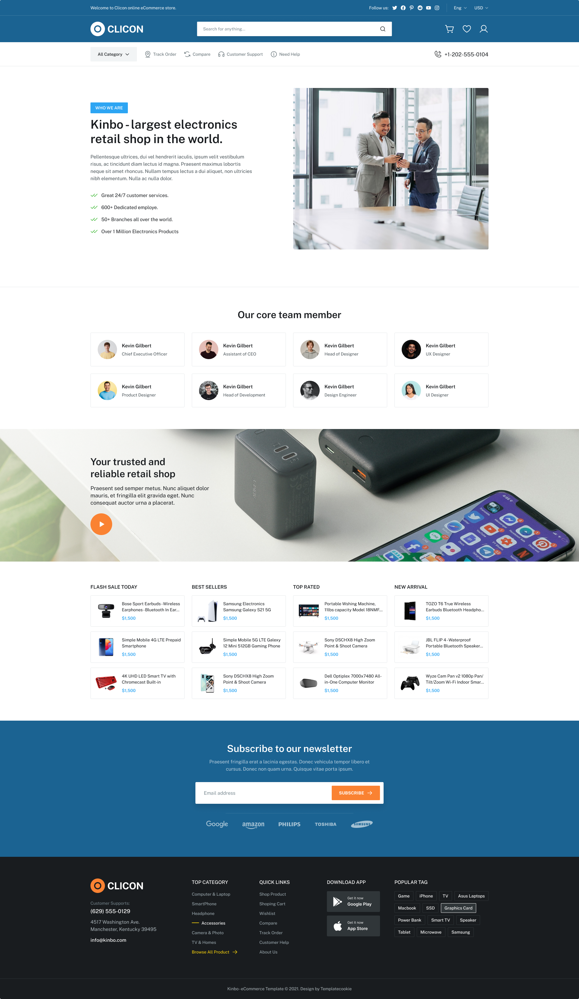 |
| 📰 Blog List | 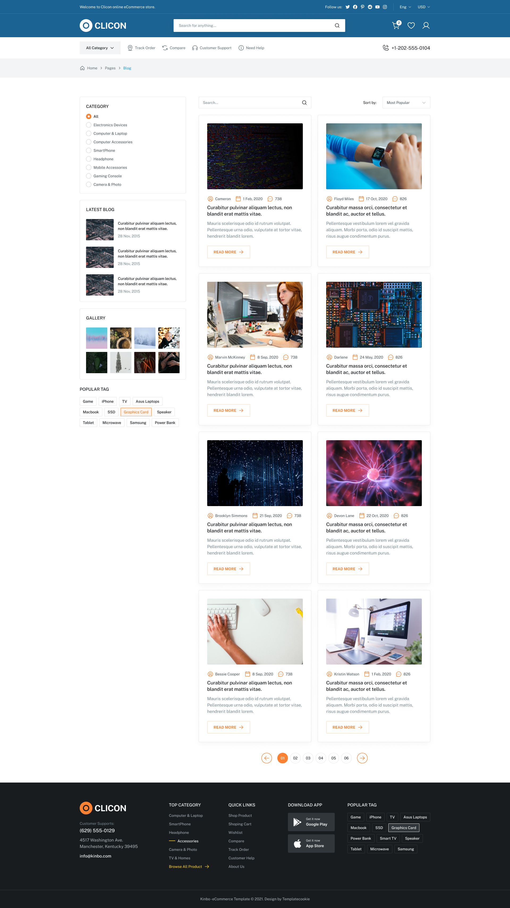 |
| 👤 Dashboard | 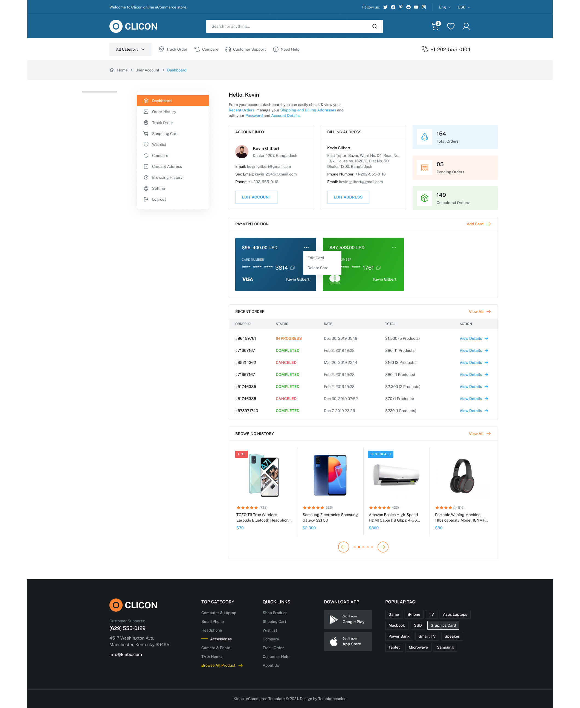 |
| 📦 Order History | 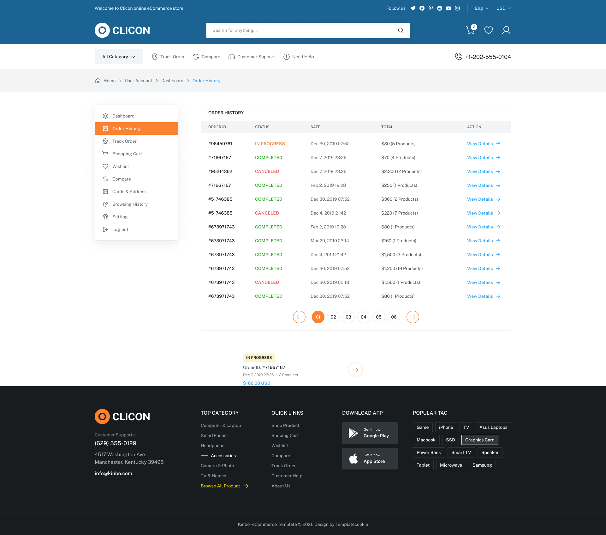 |


